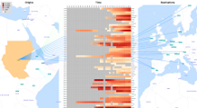

## Update: Check out <a href="https://flowmap.blue">FlowmapBlue</a>, our new tool for publishing flow maps online, and  <a href="https://flowmap.gl">flowmap.gl</a>, our JavaScript library for WebGL flow mapping

# Flow map visualization tool

This project is not developed further anymore. This repo was originally published on [Google Code](https://code.google.com/archive/p/jflowmap/). You can download a package with executable binaries [from here](https://storage.googleapis.com/google-code-archive-downloads/v2/code.google.com/jflowmap/jflowmap-0.16.6.zip).

---

JFlowMap is a research prototype developed at the University of Fribourg in which we experiment with various visualization techniques for **spatial interactions**, i.e. interactions between pairs of geographic locations. These can be migrations, movement of goods and people, network traffic, or any kind of entities "flowing" between locations. Spatial interactions are often represented as **origin-destination data**, meaning that only the origins, the destinations and the magnitudes of the flows are known, but not the exact flow routes.

The goal of our work is to develop a tool which would help to explore and analyze **temporal changes** in origin-destination data. This is what our novel visualization, [Flowstrates](doc/Flowstrates.md), is especially aimed for.

<!--Check the [DEMO applets](http://jflowmap.googlecode.com/svn/trunk/JFlowMap/demo/demo-applets.html).-->

   

  

You can also watch [the video of the Flowstrates demo](http://youtu.be/UQPN7o6A3Cg?hd=1)
 or read our [paper on Flowstrates](https://ilya.boyandin.me/p/flowstrates/flowstrates-eurovis11-fin.pdf) published in Computer Graphics Forum.

If you want to visualize your own data in JFlowMap, check [How to prepare data](doc/HowToPrepareData.md).

---

If you use JFlowMap for a scientific publication, please, reference <a href="https://ilya.boyandin.me/static/jflowmap-geova10-fa89527142106d3eab4127d399d30cbc.pdf">this paper</a> if you use the flow map view or bundling, and <a href="http://onlinelibrary.wiley.com/doi/10.1111/j.1467-8659.2011.01946.x/abstract">this one</a> if you use Flowstrates.

---

JFlowMap is developed by <a href='http://ilya.boyandin.me'>Ilya Boyandin</a> under the supervision of <a href='http://diuf.unifr.ch/people/lalanned/'>Denis Lalanne</a> and <a href='http://enrico.bertini.io'>Enrico Bertini</a>.

